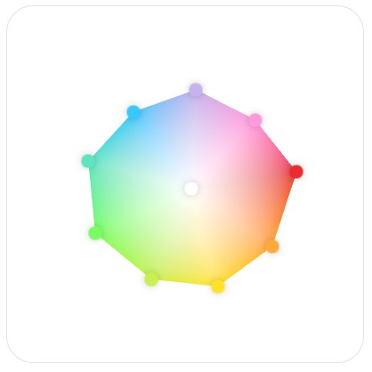
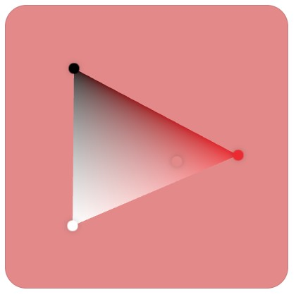

# Poulette, the color palette

Poulette a proof of concept for a color mixer interface.
[demo](https://www.grgrdvrt.com/poulette-demo)

## features
- select an existing color by clicking on a point
- click and drag on the palette to create a new color
- organize the palette by dragging the points around 
- remove an existing color by dragging it outside of the component

In theory any RGB color can be reached with Poulette. In fact you can organize the colors in more familiar configurations.
 

In practice it requires the presence of pure red, green, blue, cyan, magenta yellow, black and white in the palette. It also requires the possibility to retrieve deleted colors, which is not supported at the moment.  
For these reasons Poulette should probably be paired with an additional interface to allow the introduction of predefined colors or the reintroduction of deleted colors  

## usage
At the moment the code can't be used out of the box, you will need to adapt it if you want to include it in your project.  
Also, note that this code has not been tested on a wide range of devices and browsers. You may encounter issues.

