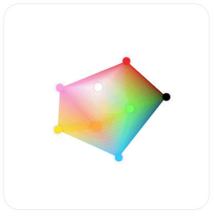
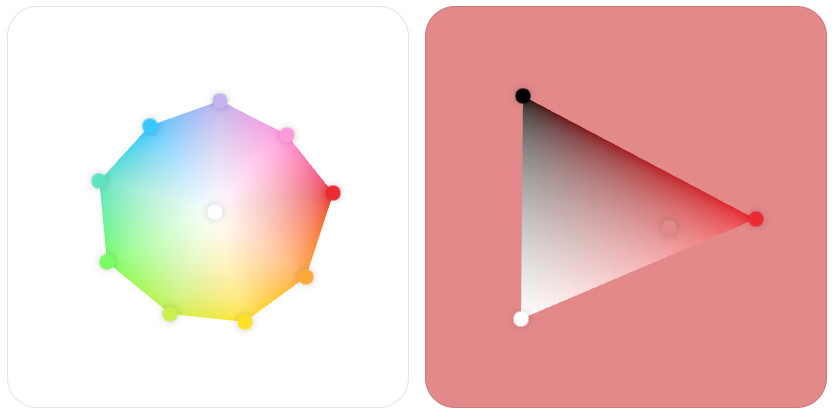

# Poulette, the color palette

Poulette is a proof of concept for a color mixer interface.  
[Play with the demo](https://www.grgrdvrt.com/poulette-demo)

## Features
- select an existing color by clicking on a point
- click and drag on the palette to create a new color
- organize the palette by dragging the points around 
- remove an existing color by dragging it outside of the component
- deleted colors appear in a list an can be re-introduced.

The the colors can be arranged in more familiar configurations. 

## Code
The wonderful [esbuild](https://esbuild.github.io/) is used for bundling the demo but any es6-compatible bundler should work.  

I chose to not package the code as a ready-to-use component as it is difficult to satisfy every react, angular, vue, svelte... but I'd be very happy to see adaptations for these frameworks.  

Note that this code has not been tested on a wide range of devices and browsers. Don't hesitate to report the issues you may find.

